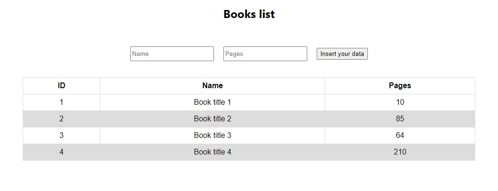

# Assignment 1

We create a default list of books in this project. We can also add a new book containing the name and number of pages to that list.

It should be noted that the one list is not saved in any database and will be deleted added data after a hard refresh.

 

## Script Features :
- Reading the textbox value

- Changing the textbox value

- Setting a function for button (Like onClick)

- Displaying a multivalue variable (Like a dictionary)

- Adding a new value to a multivalue variable

- Using Rest parameters

- Using "useRef" and "useState"

 

