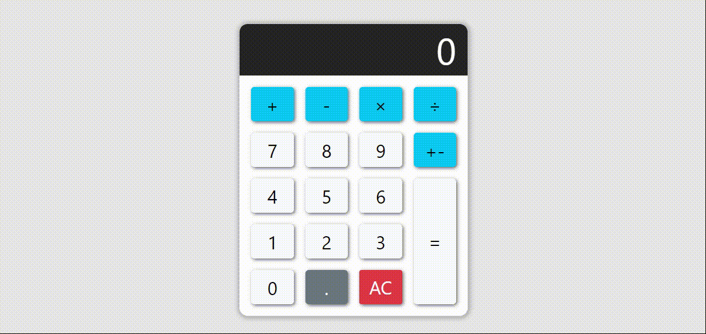

# Assignment 2

Simple calculator project with React.

This project includes four base operations and as well as reads numbers from the keyboard.

<br>



<br>

## Script Features :

- Using Arrow functions

- Usign states and set state

- Using hooks in function component (use...) 'useState' and 'useEffect'

- Installing bootstrap framework

- Using and set a bootstrap progressbar (Progressbar.js)

- Listening keyboard keys

- Convert string to integer :)

- Foldering the components

<br>

## Difference between arrow function and regular function :

```
// Regular function
function name(input){
    console.log(input);
}

// Arrow function
const name = (input) => {
    console.log(input);
}
```

<br>


## Installation

1. `npm i`

2. `npm start`

<br>

## Contributions

Any feature requests and pull requests are welcome!  :white_check_mark: