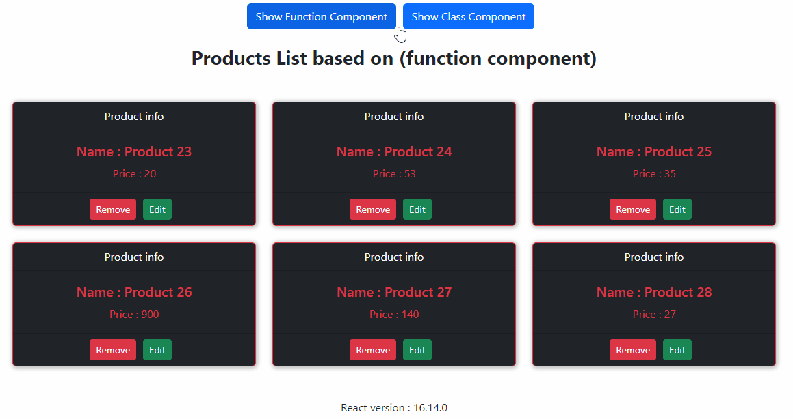
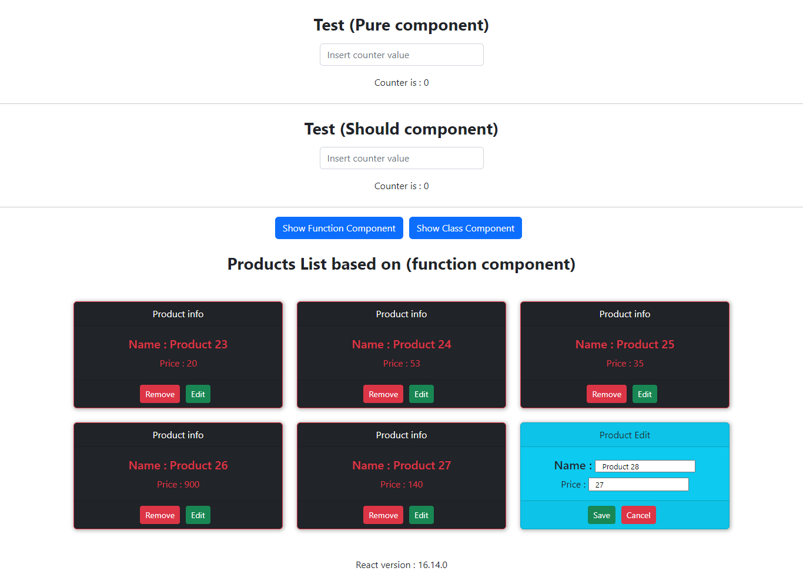

# Assignment 3

This is a simple project of an e-commerce shop that is created with two methods (Function Component) and (Class Component). In addition, it has the ability to delete and edit.

The top part of this project is a simple example of (Pure component) and (Should component).

<br>

## Screen Record



<br>

## Screenshot



<br>

## Script Features

- Using Fragment

- Implement (Function component) and (Class component)

- Send and receive data (from parent to child And vice versa)

- Using msgbox , alert 
  - window.confirm()
  - window.alert()

- Component lifecycle (Class component)

  - componentDidMount()
  - componentDidUpdate()
  - componentWillUnmount()

- Component lifecycle (Function component)
  - useEffect

- Pure component (Class component)
  - PureComponent
  - shouldComponentUpdate() ~= Pure component

- useMemo (Function component) ~= Pure component

<br>


### Internal structure of useEffect
```
useEffect(() => {
  // componentDidMount
  console.log('DidMount FC');


  // If the variable [input] exists and changes THEN
  // componentDidUpdate
  // shouldComponentUpdate (if change data)
  console.log('DidUpdate CC');


  return () => {
    // componentWillUnmount
    console.log('WillUnmount FC');
  }
}, [input])
```

<br>

### Explaining  "shouldComponentUpdate"
```
shouldComponentUpdate(nextProps, nextState) {

    // nextProps -> Input data from parent
    // nextState -> Current data in current class

    // this.props -> Previous Input data from parent before update
    // this.state -> Previous data before update

    console.log(nextProps, nextState);
    console.log(this.props, this.state);

    if (nextState.counter === this.state.counter){
        return false
    }
    else{
        return true;
    }
}
```


## Installation

1. `npm i`

2. `npm start`

<br>

## Contributions

Any feature requests and pull requests are welcome!  :white_check_mark: